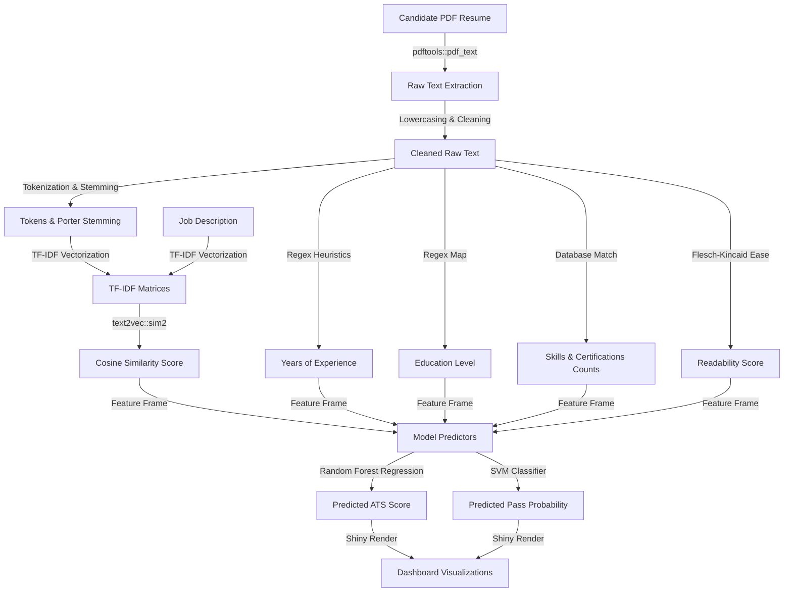

# Resume ATS Score Analytics - R Shiny Application

This is a comprehensive, production-quality final-year B.Tech Data Science project built entirely in R. The application extracts content from candidate resumes in PDF format, matches them against target job descriptions using Natural Language Processing (NLP), extracts various feature metrics, and uses Machine Learning to calculate an ATS compatibility score and predict the probability of clearing automated resume filters.

---

##  Key Features

*   **PDF Text Extraction & Cleaning**: Programmatic extraction of text from PDF resumes using `pdftools` with a robust text preprocessing, tokenization, stopword removal, and Porter stemming pipeline.
*   **Feature Engineering**: Automatically extracts:
    *   Experience years and education levels (PhD, Masters, Bachelors, etc.).
    *   Project counts and certifications.
    *   Readability score (Flesch-Kincaid formula).
    *   Counts of action verbs, programming languages, cloud skills, AI skills, and data skills.
*   **Similarity Computation**: Calculates Cosine Similarity on TF-IDF vectors of the resume and job description.
*   **Machine Learning Models**: Trains and compares multiple models on a resume pool dataset:
    *   **Regression**: Linear Regression, Decision Tree, Random Forest, SVM (predicting ATS Score).
    *   **Classification**: Random Forest Classifier, Naive Bayes, SVM Classifier (predicting Pass/Fail decision).
*   **Interactive Visual Analytics**: Interactive radar charts, word clouds, benchmarking scatter plots, and feature importance bar graphs.
*   **Resume Improvement Suggestions**: Generates customized actionable bullets to improve candidate resumes.
*   **Interactive Data Audit**: Audits job description keywords, showing matched and missing terms.
*   **PDF Report Export**: Allows downloading a professional, styled 2-page evaluation PDF report generated via R's graphics engine.

---

## Project Structure

```text
ResumeATSAnalytics/
├── app.R                  # Main Shiny Dashboard layout and server logic
├── global.R               # Configures environment, loads packages, bootstraps test data
├── requirements.md        # List of required packages and installation commands
├── README.md              # Project documentation (this file)
│
├── data/
│   ├── resumes/           # Holds sample candidate resume PDFs (auto-generated on boot)
│   ├── job_descriptions/  # Holds sample job description text files (auto-generated on boot)
│   ├── skills.csv         # Database containing categorized IT skills
│   ├── certifications.csv # Database containing IT industry certifications
│   └── stopwords.csv      # Custom list of English stopwords for text cleaning
│
├── scripts/
│   ├── 01_extract_resume.R      # PDF text extraction utilities
│   ├── 02_clean_text.R          # Case-normalizer, stopword filter, and stemmer
│   ├── 03_feature_engineering.R # Heuristic rules and TF-IDF similarity calculator
│   ├── 04_eda.R                 # Visualization generators (ggplot2 and plotly)
│   ├── 05_model_training.R      # Public dataset downloader and multi-model training pipeline
│   ├── 06_prediction.R          # Prediction score coordinator
│   └── 07_dashboard_helpers.R   # Benchmark metrics and PDF report writer
│
├── models/
│   └── randomForest_model.rds   # Serialized trained model package (auto-generated)
│
└── outputs/
    ├── graphs/            # Folder for saving visualization figures
    └── reports/           # Folder for storing generated PDF reports
```

---

## Installation & Setup

### 1. Prerequisite Dependencies
Make sure you have R and RStudio installed.
*   [Download R](https://cloud.r-project.org/)
*   [Download RStudio Desktop](https://posit.co/download/rstudio-desktop/)

For Linux environments, install the following system library required by `pdftools`:
*   *Ubuntu/Debian:* `sudo apt-get install libpoppler-cpp-dev`
*   *Fedora/CentOS:* `sudo yum install poppler-cpp-devel`
*   *macOS:* `brew install poppler`

### 2. Package Installation
Open RStudio or your R Console and run the following command to download all required packages:

```R
install.packages(c(
  "tidyverse", "ggplot2", "dplyr", "stringr", "tidytext", "tm", 
  "text2vec", "caret", "randomForest", "rpart", "e1071", "corrplot", 
  "wordcloud", "shiny", "shinydashboard", "DT", "pdftools", "readtext", 
  "quanteda", "lubridate", "plotly", "igraph", "reshape2"
))
```

---

##  Running the Application

To run the application, navigate to the `ResumeATSAnalytics/` directory in RStudio, set it as your working directory, and run the following single command in the console:

```R
shiny::runApp()
```

### Self-Healing Bootstrap Feature
On the first execution:
1.  The system will automatically create the database folders.
2.  It will download the raw datasets and generate test files (`sample_data_scientist.pdf`, `data_scientist_jd.txt`, etc.).
3.  It will automatically train the Machine Learning models (Linear Regression, Decision Tree, Random Forest, Naive Bayes, SVM) and compile `models/randomForest_model.rds`.
4.  Once the models are saved, the Shiny Dashboard will open automatically in your default browser.

---

##  Methodology & Data Pipeline



---

##  Model Performance Comparisons

The system trains models and compares performance using standard evaluation metrics:

*   **Regression Metrics** (ATS Score):
    *   *Root Mean Square Error (RMSE)*
    *   *Mean Absolute Error (MAE)*
    *   *R-Squared ($R^2$)*
*   **Classification Metrics** (Pass/Fail):
    *   *Accuracy*
    *   *Precision & Recall*
    *   *F1 Score*

*Note: The Random Forest Regression model is used as the default predictor due to its superior $R^2$ and robust capability in handling non-linear combinations of engineered features.*
