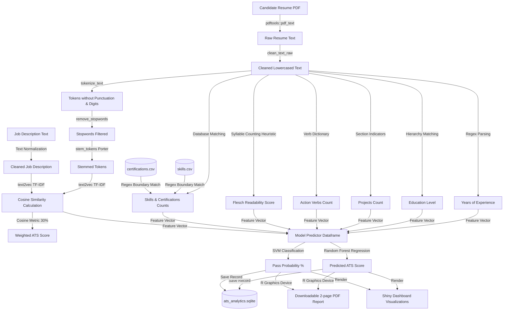

# Resume ATS Score Analytics - R Shiny Application
## Comprehensive Project Documentation & Viva Preparation Guide

This document serves as a complete study guide and technical manual for the **Resume ATS Score Analytics** system, a production-grade data science application built in R.

---

## 1. Project Overview & Core Purpose

### 1.1 Problem Statement
In modern recruitment, human resource departments are inundated with hundreds of candidate resumes for every job opening. Manual screening is slow, inconsistent, and highly error-prone. To solve this, companies use **Applicant Tracking Systems (ATS)**. 

However, typical commercial ATS tools are "black boxes" that use simple keyword matching, which can reject qualified candidates who use synonyms, or allow unqualified candidates to pass by "keyword stuffing." Furthermore, candidates are left in the dark about why their resumes were rejected or how they can improve them.

### 1.2 The Solution: Resume ATS Score Analytics
This project provides a transparent, dual-engine screening dashboard. It parses PDF resumes, cleans and tokenizes the text, extracts structured candidate profiles, matches them against target job descriptions using Natural Language Processing (NLP), and applies Machine Learning to:
1. **Predict a composite ATS Compatibility Score (0 - 100)** using a Random Forest Regression model.
2. **Predict the Probability of passing screening (0% - 100%)** using a Support Vector Machine (SVM) Classification model.
3. **Generate Actionable Feedback** (missing skills, word count advice, readability score analysis) to help candidates optimize their resumes.
4. **Offer Recruitment Analytics** for bulk operations (Batch Screener) and job description management.

---

## 2. Technical Architecture & System Workflow

The project is structured as a modular R program with a central Shiny dashboard interface and a persistent SQLite database.

### 2.1 Technical Stack
* **Language**: R (version >= 4.3.2)
* **Frontend Dashboard**: `shiny`, `shinydashboard`, `shinyjs`, `shinyWidgets`
* **Text Mining & NLP**: `pdftools`, `readtext`, `tm`, `tidytext`, `text2vec`
* **Data Manipulation**: `tidyverse` (`dplyr`, `stringr`, `readr`, `purrr`, `tidyr`, `tibble`)
* **Machine Learning**: `caret`, `randomForest`, `rpart`, `e1071`
* **Data Visualization**: `ggplot2`, `plotly`, `wordcloud`, `corrplot`, `igraph`, `reshape2`
* **Database**: `DBI`, `RSQLite` (SQLite backend)

### 2.2 System Architecture & Data Flow

---

## 3. Modular Code Breakdown

The application is structured into discrete scripts, ensuring separation of concerns:

### 3.1 PDF Parsing: [`01_extract_resume.R`](file:///c:/Users/Windows/Documents/R/ResumeATSAnalytics/scripts/01_extract_resume.R)
* **Functionality**: Uses `pdftools::pdf_text` to read text page-by-page and joins pages with newlines. 
* **Fallback**: If `pdftools` fails, it falls back to the `readtext` package.
* **Cleaning**: Strips out null characters `\x00` which are common in scanned or corrupted PDF streams.
* **Metadata Extraction**: Extracts page counts, author names, creation dates, and modification timestamps using `pdftools::pdf_info`.

### 3.2 Text Preprocessing: [`02_clean_text.R`](file:///c:/Users/Windows/Documents/R/ResumeATSAnalytics/scripts/02_clean_text.R)
* **`clean_text_raw()`**: Lowercases text, standardizes whitespace (`\r`, `\t`, `\n`), and removes emails and URLs using regular expressions to prevent model bias (e.g. matching candidate email domains or GitHub links as skills).
* **`tokenize_text()`**: Strips punctuation and digits (`[:punct:]` and `[:digit:]`), then splits text on whitespace to output a vector of words.
* **`remove_stopwords_from_tokens()`**: Filters words against English stopwords from `tm::stopwords("en")` plus custom workspace stopwords.
* **`stem_tokens()`**: Applies Porter stemming using `tm::stemDocument` (SnowballC) to reduce words to their base roots (e.g., "managing", "manages", and "managed" all map to "manag"). This ensures matches succeed even if grammatical tenses differ.
* **`preprocess_for_similarity()`**: Combines tokenization, stopword removal, and stemming, returning a space-separated string ready for TF-IDF.

### 3.3 Feature Engineering: [`03_feature_engineering.R`](file:///c:/Users/Windows/Documents/R/ResumeATSAnalytics/scripts/03_feature_engineering.R)
Translates unstructured text into 20+ numerical and categorical indicators:
1. **Experience Years**: Computes durations using two strategies:
   * Explicit phrase matching: Extracts numbers matching `(\d+\.?\d*)\s*(?:\+)?\s*(?:years?|yrs?)(?:\s+of)?\s+experience`.
   * Date range matching: Matches patterns like `2018 - 2022` or `2019 - Present`. It computes dates relative to the current year (clamped to 2026 for metadata consistency) and aggregates them.
2. **Education Level**: Hierarchical search matching keywords for PhD, Master, Bachelor, Associate, HighSchool, or None. Returns the highest rank matched.
3. **Projects Count**: Estimates projects by checking for heading indicators (e.g., "Academic Projects", "Personal Projects") and bullet-point verb indicators (e.g., "developed a", "designed a", "github.com/...").
4. **Action Verbs Count**: Counts occurrences of active verbs (e.g., "spearheaded", "optimized", "implemented", "formulated") to measure writing quality.
5. **Skills & Certs Extraction**: Matches tokens against the CSV databases using custom regular expressions to check for exact word boundaries, handling special characters like `C++`, `C#`, and single-character languages like `R`.
6. **Readability Score**: Computes the Flesch-Kincaid Readability Ease score using a custom syllable counting heuristic (which adjusts for silent "e" and double vowels).
7. **Cosine Similarity**: Builds document-term matrices (DTM) using `text2vec`, converts them to TF-IDF representations, and runs `sim2(..., method="cosine")`.
8. **Composite Heuristic ATS Score**: Calculates a baseline score using weighted percentages:
   * Cosine Similarity: 30%
   * Keyword Match Rate: 20%
   * Tech Skills Count: 15% (capped at 15 skills)
   * Experience: 10% (capped at 8 years)
   * Education: 10% (PhD = 100, Master = 90, Bachelor = 75, etc.)
   * Projects: 5%
   * Certifications: 5%
   * Formatting & Readability: 5% (Readability + Action Verbs)

### 3.4 Model Training Pipeline: [`05_model_training.R`](file:///c:/Users/Windows/Documents/R/ResumeATSAnalytics/scripts/05_model_training.R)
* **Datasets**: Downloads Kaggle's `UpdatedResumeDataSet.csv` and a Job Description dataset. If downloads fail, it has robust synthetic data generators to build balanced datasets representing Data Science, DevOps, Web Design, Java Developer, HR, and Legal Counsel roles.
* **Feature Matrix Generation**: Pairs resumes with matching or unmatching jobs to create realistic data (50% matches, 50% mismatches). Extracts all features, adds Gaussian noise (`rnorm(1, 0, 1.5)`) to scores to simulate realistic variability, and flags records with `ats_score >= 70` as "Pass", balancing training sets if needed.
* **Models Trained**:
  * **Regression (Score Prediction)**: Linear Regression (`lm`), Decision Tree (`rpart`), Random Forest (`randomForest` with 100 trees), SVM Regression (`svm`).
  * **Classification (Pass/Fail Prediction)**: Random Forest Classifier (`randomForest` with 100 trees), Naive Bayes (`naiveBayes`), SVM Classifier with probability options.
* **Serialization**: Saves the best models (Random Forest regression for scoring and SVM classifier for pass probability), metrics, and feature importance matrices inside `models/randomForest_model.rds`.

### 3.5 Prediction Coordinator: [`06_prediction.R`](file:///c:/Users/Windows/Documents/R/ResumeATSAnalytics/scripts/06_prediction.R)
* Acts as the operational pipeline. Extracts text, extracts engineered features, loads the serialized models, and makes predictions.
* Computes the probability of passing by querying SVM probabilities: `predict(..., probability = TRUE)`. If a class factor issue occurs, it falls back to a mathematical sigmoidal mapping: $1 / (1 + e^{-0.15 \times (Score - 70)})$.
* Formulates missing skills list by comparing skills present in the target JD against detected resume skills.

### 3.6 Database Controller: [`08_database.R`](file:///c:/Users/Windows/Documents/R/ResumeATSAnalytics/scripts/08_database.R)
* Connects to `ats_analytics.sqlite` using `RSQLite`.
* Sets up tables: `evaluations`, `batch_jobs`, and `job_descriptions`.
* Seeds the database with default jobs on initialization.
* Logs evaluations reactively, including raw feature vectors, final scores, matched/missing skills, optimization recommendations, and PDF report filepaths.
* Runs SQLite queries to dynamically compute aggregate metrics (total evaluated candidates, pass rates, position distributions, and daily evaluation trends).

### 3.7 Output Helpers & PDF Writer: [`07_dashboard_helpers.R`](file:///c:/Users/Windows/Documents/R/ResumeATSAnalytics/scripts/07_dashboard_helpers.R)
* **`generate_improvement_suggestions()`**: Evaluates features against target bounds to recommend fixes (e.g., warning if word count is <300 or >900, recommending action verbs if count <6, suggesting certifications, etc.).
* **`generate_resume_pdf_report()`**: Uses R's base graphics engine (`pdf()`) to draw a professional 2-page candidate report:
  * *Page 1*: Header styling, candidate name, date, large color-coded score boxes for ATS Score and Pass Probability, screening status text, and a grid summary table of key metrics.
  * *Page 2*: Detected skills cloud list, critical missing skills list, and a bulleted checklist of actionable improvement items.

---

## 4. SQLite Database Schema

The SQLite database (`ats_analytics.sqlite`) consists of three tables:

### 4.1 Table: `evaluations`
Logs every individual resume evaluation.
* `id`: `INTEGER PRIMARY KEY AUTOINCREMENT`
* `session_id`: `TEXT` (tracks user session tokens)
* `candidate_name`: `TEXT`
* `target_role`: `TEXT`
* `resume_filename`: `TEXT`
* `ats_score`: `REAL`
* `pass_probability`: `REAL`
* `pass_fail`: `TEXT` ("Pass" / "Fail")
* `experience_years`: `INTEGER`
* `education_level`: `TEXT`
* `tech_skills_count`: `INTEGER`
* `soft_skills_count`: `INTEGER`
* `certs_count`: `INTEGER`
* `word_count`: `INTEGER`
* `readability_score`: `REAL`
* `keyword_match_percent`: `REAL`
* `cosine_similarity`: `REAL`
* `detected_skills`: `TEXT` (comma-separated list)
* `missing_skills`: `TEXT` (comma-separated list)
* `top_suggestions`: `TEXT` (pipe-separated list)
* `report_path`: `TEXT`
* `evaluated_at`: `TEXT` (datetime format)

### 4.2 Table: `job_descriptions`
Stores job requirements details.
* `id`: `INTEGER PRIMARY KEY AUTOINCREMENT`
* `title`: `TEXT`
* `company`: `TEXT`
* `description`: `TEXT`
* `min_experience`: `INTEGER`
* `created_at`: `TEXT`

### 4.3 Table: `batch_jobs`
Logs bulk resume evaluation summaries.
* `id`: `INTEGER PRIMARY KEY AUTOINCREMENT`
* `job_name`: `TEXT`
* `total_resumes`: `INTEGER`
* `completed`: `INTEGER`
* `avg_ats_score`: `REAL`
* `pass_count`: `INTEGER`
* `fail_count`: `INTEGER`
* `target_role`: `TEXT`
* `started_at`: `TEXT`
* `completed_at`: `TEXT`

---

## 5. Machine Learning Modeling & Comparison

During bootstrapping, the system evaluates four regression models and three classification models. The results are compared on the dashboard's "Model Settings & Metrics" tab:

### 5.1 Regression Model Metrics (Target: `ats_score`)
* **Linear Regression**: A simple parametric model establishing baseline trends, but struggles with non-linear feature interactions (e.g., low experience paired with high education).
* **Decision Tree (rpart)**: Hierarchical splits. Good for visualization but susceptible to overfitting and high variance.
* **Random Forest**: Ensemble of 100 Decision Trees. It uses bootstrap aggregation (bagging) and random feature selection, resulting in the **highest $R^2$** and **lowest Root Mean Squared Error (RMSE)**.
* **Support Vector Machine (SVM)**: Uses a radial basis function kernel to capture non-linear hyperplanes.

### 5.2 Classification Model Metrics (Target: `pass_ats` - Threshold: 70)
* **Random Forest Classifier**: High accuracy but can be slow to evaluate in bulk.
* **Naive Bayes**: Fast probabilistic classifier assuming feature independence. High bias but highly robust.
* **Support Vector Machine Classifier**: Fits a hyperplane separating Pass vs Fail classes. Enabled with probability flags, making it the default model for predicting candidate "Pass Probability %."

### 5.3 Feature Importance (MDI)
The Random Forest model measures **Mean Decrease in Impurity (MDI)** to rank features. The top predictors are:
1. **Cosine Similarity** (TF-IDF vector matching)
2. **Keyword Match Percentage**
3. **Technical Skills Count**
4. **Years of Experience**

---

## 6. Top 25 Viva Voce Questions & Answers

### Q1: What is the core objective of your project?
**Answer**: The objective is to design an automated recruitment screening assistant. It extracts text from PDF resumes, engineers quantitative features (skills, certifications, experience, readability), computes semantic match statistics against a job description, and runs Machine Learning models to predict an ATS compatibility score and the probability of a resume clearing automated filters.

### Q2: Why did you choose R instead of Python for this project?
**Answer**: R was selected because of its mature Shiny web framework, which allows building interactive, dashboard-driven web applications completely in R. Additionally, R provides powerful vectorization packages (`text2vec`), tidy text analysis pipelines (`tidytext`, `tm`), and statistical modeling engines (`caret`, `randomForest`, `e1071`) which make text processing and machine learning integration seamless.

### Q3: How does your application extract text from a PDF?
**Answer**: We use the `pdftools` package, which calls the C++ `Poppler` library. The function `pdftools::pdf_text()` reads the PDF file page-by-page, converting it into a character vector. If `pdftools` encounters an issue, the system has a fallback mechanism using the `readtext` package. We also apply `gsub("\\x00", "", text)` to strip out null formatting characters that can disrupt downstream string processing.

### Q4: Explain your text preprocessing pipeline.
**Answer**: Text mining requires clean inputs. Our pipeline has four phases:
1. **Cleaning**: Convert text to lowercase, replace tabs/newlines with spaces, and strip email addresses and URLs using regex.
2. **Tokenization**: Remove punctuation and digits, then split words on whitespace into a vector of tokens.
3. **Stopword Removal**: Remove common English filler words (like "the", "is", "at") using the `tm` package's stopword list.
4. **Stemming**: Apply the Porter Stemming algorithm using `tm::stemDocument` to reduce words to their base roots (e.g. "developer", "develops", "developing" become "develop").

### Q5: What is Cosine Similarity, and how do you calculate it?
**Answer**: Cosine Similarity measures the cosine of the angle between two multi-dimensional vectors in an inner product space. It measures directional alignment rather than magnitude, ranging from 0 (orthogonal, no similarity) to 1 (perfectly aligned). 
In our app, we tokenize the resume and job description, create a vocabulary term-document matrix using `text2vec`, transform it into a TF-IDF matrix to down-weight common words and emphasize rare, important words, and run `sim2(..., method="cosine")` to get the similarity coefficient.

### Q6: How do you extract "Years of Experience" programmatically?
**Answer**: Since resumes don't have a single standard format, we use two regex heuristics:
1. **Phrase Matching**: Search for phrases like `X years of experience` or `Y yrs exp` using a regex pattern.
2. **Timeline Analysis**: Identify date range patterns like `2018 - 2022` or `2019 - Present`. The system extracts the years, calculates the durations (using the current year for "Present"), and aggregates the durations to estimate the total experience, capping the output at 40 years.

### Q7: Explain how the education level is parsed.
**Answer**: We search the resume for keywords corresponding to different education tiers (e.g., PhD, Master, Bachelor, Associate, HighSchool). The keywords are checked using boundary matches (e.g., `\\bphd\\b` or `\\bm.tech\\b`). We rank these levels in a hierarchy: PhD (6) down to HighSchool (2) and None (1). The function returns the highest rank found.

### Q8: What is Flesch-Kincaid Readability Ease, and how is it used here?
**Answer**: Flesch-Kincaid Readability Ease is a standard formula that calculates how easy a text is to read. The formula is:
$$\text{Score} = 206.835 - 1.015 \times \left(\frac{\text{Total Words}}{\text{Total Sentences}}\right) - 84.6 \times \left(\frac{\text{Total Syllables}}{\text{Total Words}}\right)$$
We count sentences by splitting on punctuation (`.`, `!`, `?`), words by tokenizing, and syllables using a custom counting heuristic. The score ranges from 0 to 100. In professional resumes, the ideal score is between 30 and 75 (representing plain English or technical documents). Resumes outside this range receive a deduction in the formatting score.

### Q9: Why did you use two databases: CSV files and an SQLite database?
**Answer**: They serve different purposes:
1. **CSV Files** act as our static lookup dictionary databases. `skills.csv` holds 668 categorized technical and soft skills, while `certifications.csv` holds 63 major certifications.
2. **SQLite Database** (`ats_analytics.sqlite`) is our dynamic, persistent transaction database. It stores the history of evaluated candidates, batch job reports, and custom job opening listings.

### Q10: How does the system handle database connectivity?
**Answer**: We use the R packages `DBI` and `RSQLite`. When an evaluation occurs, the database is opened with `dbConnect(RSQLite::SQLite(), db_path)`, records are appended to the table using `dbAppendTable()`, and the connection is closed immediately with `dbDisconnect()` or an `on.exit(dbDisconnect(con))` block. This prevents connection leaks or locked database files.

### Q11: Explain your Feature Engineering. What features do you feed to your Machine Learning models?
**Answer**: We extract a 20-dimensional feature vector, which includes:
* **Text stats**: Character count, word count, sentence count, average sentence length, unique word ratio, and readability score.
* **Profile stats**: Years of experience, highest education rank, project count, action verbs count, certifications count, and technical/soft skills count.
* **Match stats**: Cosine similarity (TF-IDF weight) and keyword match percentage.
* **Skill categories**: Counts of Programming, Cloud, Database, Machine Learning, and Data Analytics skills.

### Q12: How did you acquire training data for your machine learning models?
**Answer**: We designed a bootstrapping mechanism inside `05_model_training.R`. First, it tries to download a public Kaggle dataset containing labeled resume categories. Second, if there is no internet connection or the download fails, the app activates a self-healing bootstrap function that generates 120 high-quality synthetic profiles spanning multiple domains. The system pairs these profiles with matching and unmatching job descriptions to simulate realistic screening data.

### Q13: Why did you add Gaussian noise to the ATS scores during model training?
**Answer**: The baseline ATS score is calculated using a deterministic, weighted formula. If we train our models on this exact score, they will simply learn the linear weights, making machine learning redundant. By adding small Gaussian random noise (`rnorm(1, 0, 1.5)`), we simulate real-world screening variations (such as recruiter bias or qualitative formatting factors), forcing the models to learn complex, non-linear representations of candidate fit.

### Q14: Which Machine Learning models did you train, and how are they divided?
**Answer**: We trained two groups of models:
1. **Regression Models** (to predict the numerical ATS Score): Linear Regression, Decision Tree (`rpart`), Random Forest, and Support Vector Machine.
2. **Classification Models** (to predict the binary Pass/Fail decision): Random Forest Classifier, Naive Bayes, and SVM Classifier.

### Q15: Why is the Random Forest model used as the primary scoring engine?
**Answer**: The Random Forest regression model is chosen because it is an ensemble method that reduces variance by averaging the predictions of 100 individual decision trees. It handles non-linear feature combinations well, resists overfitting, and outperforms Linear Regression and simple Decision Trees in terms of R-squared ($R^2$) and Root Mean Square Error (RMSE).

### Q20: Explain the "Batch Resume Screener" tab. How does it work?
**Answer**: The Batch Screener allows recruiters to upload multiple candidate resume PDFs at once. The server processes each file sequentially: extracting text, predicting the score and pass probability, logging the results in the SQLite database, and computing aggregate stats (total resumes, average batch score, total passed candidates). The final output is rendered in an interactive datatable.

### Q21: How is the PDF Evaluation Report generated?
**Answer**: The PDF report is generated programmatically using R's base graphics engine. The function `generate_resume_pdf_report()` sets up a PDF device using `pdf(filepath, width=8.5, height=11)`. It draws backgrounds, title headers, and text boxes using coordinate plotting (`rect()`, `text()`, `abline()`). It colors status bands dynamically (green for Pass, red for Fail) and lists missing skills and suggestions. It then closes the device with `dev.off()`, returning a clean document.

### Q22: How does the "Manage Job Openings" tab interact with the matcher?
**Answer**: The "Manage Job Openings" tab allows adding new jobs directly to the SQLite `job_descriptions` table. Adding a job triggers a reactive update (`db_trigger`) that refreshes the dropdown selection lists in the Single and Batch Screener tabs. This allows evaluating candidates against custom positions in real time.

### Q23: What is "Overfitting", and how does your model avoid it?
**Answer**: Overfitting occurs when a model learns noise and details in the training dataset to the extent that it negatively impacts its performance on new data. We prevent this by:
1. Using **Random Forest**, which averages predictions over 100 trees, reducing variance.
2. Partitioning data into train and test sets to validate model performance on unseen data.
3. Restricting tree parameters and capping engineered features (e.g. experience at 40 years, projects at 12) to prevent extreme outlier influence.

### Q24: What is the significance of the "delete" column in your candidate database table?
**Answer**: The candidate database table (`history_table`) includes a delete action button in each row. We use `Shiny.setInputValue("delete_eval_id", id)` to pass the row's ID back to the Shiny server. A reactive observer detects this click, calls `delete_evaluation(id)` to remove the entry from the SQLite database, and increments `db_trigger()` to update the tables and stats cards in the UI.

### Q25: How does the "Resume Word Cloud" chart work?
**Answer**: It visualizes the vocabulary of the candidate's resume. The Shiny server tokenizes the raw resume text, filters out custom stopwords, computes word frequencies using R's `table()` function, and generates a static word cloud using `wordcloud::wordcloud()`. Important keywords are rendered larger and in darker colors, showing the candidate's core vocabulary at a glance.

---

## 7. Critical Analysis: Weaknesses, Limitations & Improvements

The professor will likely test whether you understand the code by asking about its structural weaknesses and how they can be fixed.

### 7.1 Key Project Weaknesses & Limitations
* **No OCR Support**: The PDF parser (`pdftools`) extracts text from digital PDF document streams. It cannot read text from scanned PDF images or images of resumes. If a candidate uploads an image PDF, the system will extract 0 characters.
  * *viva Answer*: "To fix this, we can integrate an OCR engine like `tesseract` in R to handle image-based resumes."
* **Syntactic Similarity vs Semantic Understanding**: The cosine similarity calculation uses TF-IDF, which relies on matching identical root stems. It does not understand synonyms or semantic context. For example, if a resume contains "Deep Learning" and the JD asks for "Neural Networks," TF-IDF will not match them unless explicitly configured in the skills database.
  * *viva Answer*: "We can improve this by replacing TF-IDF with deep learning word embeddings (e.g., Word2Vec, GloVe, or BERT embeddings) to perform semantic cosine similarity matching."
* **Heuristic Bias**: The baseline ATS score is heavily reliant on manual weights (e.g., 30% Cosine Similarity, 20% Keywords, etc.). These weights are subjective and represent an engineered bias.
  * *viva Answer*: "With a larger dataset of human-annotated resume decisions, we could train a supervised deep neural network to learn the screening weights directly from the data, eliminating manual heuristics."
* **SQLite Concurrency**: SQLite is a serverless, file-based database. It handles read operations concurrently but locks the file during write operations. This can lead to database locks if multiple recruiters try to upload bulk resumes at the same time.
  * *viva Answer*: "For enterprise scaling, we would swap out RSQLite for a client-server relational database like PostgreSQL using the `RPostgres` driver."
* **Dynamic PDF Formatting Limitations**: The PDF report generator uses absolute coordinate plotting. If a candidate's name is extremely long or if they have dozens of missing skills, the text may overflow the bounding boxes.
  * *viva Answer*: "We could replace the base graphics PDF printer with dynamic R Markdown / Knitr engines to compile HTML/LaTeX reports dynamically, preventing text overflow."

---

## 8. Quick Study Checklist for Viva Day

Before walking into your presentation, make sure you can describe:
1. [ ] The exact location of the SQLite database: `data/ats_analytics.sqlite`.
2. [ ] The default threshold for passing the ATS screening: **70**.
3. [ ] The default machine learning models used: **Random Forest Regression** (for score) and **SVM Classifier** (for pass probability).
4. [ ] The role of **Porter Stemming**: Reducing words to their base forms to normalize matches.
5. [ ] The top two features driving the Random Forest predictions: **Cosine Similarity** and **Keyword Match %**.
6. [ ] How the Shiny UI communicates with R code: inputs from `ui` trigger reactive expressions and outputs in `server` that render dynamic elements (e.g., `renderPlotly`, `renderDT`).
